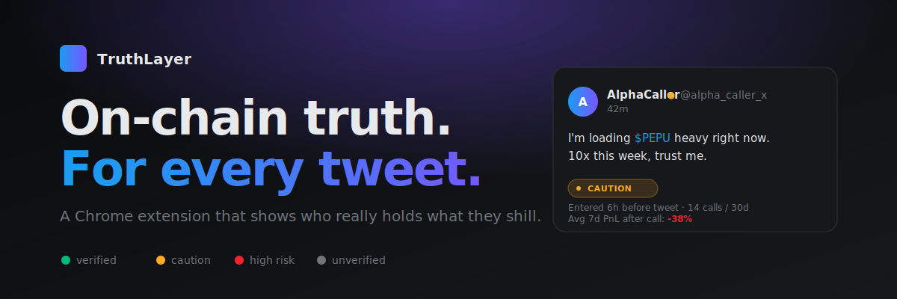

<div align="center">



<br />

# TruthLayer

### See who really holds what they shill.

A Chrome extension that injects on-chain reality checks next to every tweet on X.<br/>
**Catch a shill before you ape into it.**

<br />

[](https://github.com/youngboy91-beep/bam/stargazers)
[](#license)
[](https://chrome.google.com/webstore)
[](https://www.typescriptlang.org)
[](https://www.postgresql.org)

<a href="#-quick-start">Quick start</a> · 
<a href="#-how-it-works">How it works</a> · 
<a href="#-deploy-in-15-minutes-0mo">Deploy</a> · 
<a href="#-faq">FAQ</a> · 
<a href="https://github.com/youngboy91-beep/bam/issues/new">Report bug</a>

<br />

⭐ **If you've ever been rugged by a Twitter "alpha caller" — star this repo.** Every star helps us prioritize.

<br />

</div>

---

## 🎯 The problem

Every day on Crypto Twitter:

- 🎭 KOLs shill tokens they **bought minutes before the tweet** and dump on followers
- 📉 Serial callers push "100x guaranteed" while their **historical PnL is −70%**
- 🚨 New accounts promote rug pulls as "based dev, LFG" — and you find out **after** you ape

You can't tell who's real and who's not. Until now.

## 💡 The solution

TruthLayer adds a **single 8-pixel colored dot** next to every handle on X.

| Color | Meaning |
|:-----:|---------|
| 🟢 | **Verified holder** — claimed wallet, clean history |
| 🟡 | **Caution** — entered position before tweet, serial caller |
| 🔴 | **High risk** — linked to rug pulls, concentrated supply |
| ⚪ | **Unverified** — no wallet claimed yet |

Hover the dot → full report opens with three metrics, one-line explanation, and **direct links to Etherscan, DEXScreener, Arkham, DeBank, Solscan, RugCheck**.

No bloat. No banners under every tweet. Your feed stays clean.

<details>
<summary><b>📸 What it actually looks like</b></summary>

Open `reference/dot-hover.html` in your browser for a static preview, or follow the [Quick start](#-quick-start) below.

The hover card shows:
- Identity tier (A / B / B+ / C) with verification level
- Three metrics: holds token, shill history, avg PnL after calls
- External links grouped by chain and by token
- Human-readable verdict in one line

</details>

---

## 🆚 How it compares

|                                  | TruthLayer | Nansen | Arkham | DEXScreener | Wallet Guard |
|----------------------------------|:----------:|:------:|:------:|:-----------:|:------------:|
| Inline overlay on Twitter         | ✅          | ❌      | ❌      | ❌           | ❌            |
| Per-author shill history          | ✅          | ❌      | ❌      | ❌           | ❌            |
| One-click claim → verified badge  | ✅          | ❌      | ❌      | ❌           | ❌            |
| Multi-chain (ETH+SOL+L2s)         | ✅          | ✅      | ✅      | ✅           | partial      |
| Free tier                         | ✅          | ❌      | partial| ✅           | ✅            |
| Open source                       | ✅          | ❌      | ❌      | ❌           | ❌            |

## ⚙️ How it works

```
       you read a tweet on X
                │
                ▼
     ┌──────────────────────┐
     │  Content script      │ ◄── extracts @handle + $TICKER from tweet DOM
     │  (Chrome MV3)        │
     └──────────┬───────────┘
                │
                ▼
     ┌──────────────────────┐
     │  Background worker   │ ◄── attaches Bearer JWT, caches per scoring_version
     └──────────┬───────────┘
                │  HTTPS
                ▼
     ┌──────────────────────┐
     │  Fastify API         │ ◄── server-side scoring, no thresholds in client
     │  /v1/score           │
     │  /v1/claim           │
     │  /v1/session         │
     └──────────┬───────────┘
                │
                ▼
     ┌──────────────────────┐
     │  Postgres            │ ◄── identities · wallets · links · sessions
     └──────────────────────┘
```

**Why this design**

- 🔒 **Server-side policy.** The extension is a *pure renderer* — no thresholds, weights, or formulas in the client bundle. Reverse-engineering reveals nothing.
- 🔐 **SIWE + SIWS auth.** Wallets prove ownership with EIP-4361 (EVM) or Ed25519 (Solana). Single-use nonces, 10-minute TTL, replay-rejection.
- 🛡️ **Build-time external URLs.** Etherscan / DEXScreener links are constants in the bundle. A compromised API can't redirect users to phishing sites.
- ⏱️ **Defense-in-depth abuse resistance.** Nine documented attack families with multiple independent counters. See [`docs/abuse-resistance.md`](docs/abuse-resistance.md).

## ✨ Features

| Feature | Status |
|---------|:------:|
| Inline dot overlay on x.com | ✅ |
| Hover card with 3 metrics + explanation | ✅ |
| External links: Etherscan, DEXScreener, Arkham, DeBank, Solscan, Birdeye, RugCheck, Zapper | ✅ |
| Self-onboarding claim flow (SIWE + SIWS) | ✅ |
| Multi-chain: Ethereum, Solana, Base, Arbitrum, BNB | ✅ |
| Anonymous session — no login wall | ✅ |
| Postgres persistent identity graph | ✅ |
| Production Dockerfile + Railway template | ✅ |
| Real on-chain data adapters (Alchemy / Helius) | 🔨 In progress |
| Twitter OAuth | 🔨 In progress |
| Chrome Web Store listing | 🔨 In review |
| Pro tier + Stripe billing | 📋 Planned |
| B2B API for wallets / exchanges | 📋 Planned |

---

## 🚀 Quick start

```bash
git clone https://github.com/youngboy91-beep/bam.git
cd bam
npm install
npm run dev:all
```

That spins up:

| Service | URL |
|---------|-----|
| API | http://localhost:8787 |
| Claim web | http://localhost:5173 |
| Extension dist | `apps/extension/dist/` |

Then:

1. Open `chrome://extensions` → enable Developer mode → **Load unpacked** → select `apps/extension/dist`
2. Open https://x.com — colored dots appear next to every handle
3. Open http://localhost:5173 — claim your wallet in 30 seconds

### Smoke test

```bash
npm run smoke
```

Real EVM keypair → SIWE signature → API verify → A-tier recorded → replay rejected. ~3 seconds.

---

## 🌐 Deploy in 15 minutes ($0/mo)

<p align="center">
<a href="https://railway.app/new/template?repo=https://github.com/youngboy91-beep/bam"></a>&nbsp;
<a href="https://vercel.com/new/clone?repository-url=https://github.com/youngboy91-beep/bam&root-directory=apps/claim-web&env=TL_API_BASE&envDescription=Your%20Railway%20API%20URL"></a>
</p>

| Step | Service | What you get | Cost |
|------|---------|-------------|------|
| 1 | [Supabase](https://supabase.com/dashboard/new) | Postgres database | Free |
| 2 | [Railway](https://railway.app) | API hosting | Free hobby |
| 3 | [Vercel](https://vercel.com) | Claim web hosting | Free |
| 4 | Chrome Web Store | Extension listing | $5 once |

**Total: $5 one-time, $0/month** — handles 1000+ MAU comfortably.

Detailed walkthrough: **[DEPLOY.md](./DEPLOY.md)**

### Or pull pre-built image

```bash
docker pull ghcr.io/youngboy91-beep/bam/api:latest
docker run -p 8787:8787 \
  -e DATABASE_URL=postgres://... \
  -e TL_JWT_SECRET=$(openssl rand -hex 32) \
  ghcr.io/youngboy91-beep/bam/api:latest
```

---

## 🏗️ Tech stack

| Layer | Choice | Why |
|-------|--------|-----|
| Extension | **Chrome MV3 + React + Shadow DOM** | Twitter's CSS can't break us, ours can't leak |
| Build | **Vite (content) + esbuild (worker)** | Single-file IIFE for content scripts, fast HMR |
| API | **Fastify + TypeScript** | Lowest overhead Node framework |
| Auth | **EIP-4361 SIWE + Ed25519 SIWS** | Wallet-native, no email |
| Crypto | **`@noble/curves`, `ethereum-cryptography`** | Audited, zero-dependency |
| DB | **Postgres** (Supabase) | One source of truth, no NoSQL ceremony |
| Hosting | **Railway + Vercel + Cloudflare Pages** | All free tiers, all GitHub-integrated |

## 📁 Project structure

```
bam/
├── apps/
│   ├── api/              ← Fastify API: auth, scoring, identity graph
│   ├── extension/        ← Chrome MV3: dot overlay + hover card + popup
│   └── claim-web/        ← Self-onboarding page
├── packages/
│   └── shared/           ← TypeScript contracts shared everywhere
├── docs/                 ← Public specs (principles only)
├── reference/            ← Static HTML mockups
└── .kiro/steering/       ← AI-agent invariants
```

## 📚 Docs

| Document | Topic |
|----------|-------|
| [identity-graph.md](docs/identity-graph.md) | How handles link to wallets (A/B/B+/C tiers) |
| [scoring.md](docs/scoring.md) | What the overlay measures and why |
| [abuse-resistance.md](docs/abuse-resistance.md) | 9 attack families and defenses |
| [monetization-and-auth.md](docs/monetization-and-auth.md) | Freemium B2C + B2B API model |
| [scalability.md](docs/scalability.md) | Growth stages and graceful degradation |
| [release-strategy.md](docs/release-strategy.md) | Phase 1 → 2 → 3 rollout plan |
| [data-pipeline.md](docs/data-pipeline.md) | External data domains consumed |
| [DEPLOY.md](DEPLOY.md) | Step-by-step production setup |
| [TESTING.md](TESTING.md) | How to run and report bugs |

---

## 🗺️ Roadmap

- [x] Inline dot overlay on x.com
- [x] Hover card with metrics + external links
- [x] SIWE + SIWS claim flow
- [x] Anonymous session bootstrap
- [x] Postgres persistent graph
- [x] Production Dockerfile + Railway/Vercel configs
- [ ] Alchemy / Helius adapters (real on-chain balances)
- [ ] Twitter OAuth (replace stub verifier)
- [ ] Chrome Web Store launch
- [ ] Farcaster + Lens platform support
- [ ] Pro tier ($15/mo) with custom alerts
- [ ] B2B API (wallets, exchanges, analytics tools)
- [ ] B+ context-match inference (NLP + on-chain co-activity)

## ❓ FAQ

<details>
<summary><b>Why a Chrome extension and not a website?</b></summary><br/>

Because traders read X, not yet-another-dashboard. The data has to live where they already are. A standalone site adds friction the product is designed to remove.
</details>

<details>
<summary><b>How do you prevent fake A-tier claims?</b></summary><br/>

A-tier requires a cryptographic signature from the wallet **plus** an active Twitter session for the handle. The signed message is built server-side and matched verbatim. Single-use nonces with bounded TTL block replays. See [`docs/abuse-resistance.md`](docs/abuse-resistance.md).
</details>

<details>
<summary><b>What about smart-contract wallets (Safe, Argent)?</b></summary><br/>

Routed through a delayed-challenge path. The signature is re-verified at a later block height to ensure the claimer holds durable signing authority — not a transient multisig role.
</details>

<details>
<summary><b>Will this work on Firefox or Brave?</b></summary><br/>

Brave: yes, it's Chromium-based. Firefox: planned after Chrome Web Store stable.
</details>

<details>
<summary><b>Is this open source?</b></summary><br/>

Source-available under proprietary license. You can read it, run it, fork for personal use, contribute back. No commercial redistribution. The point: trust through transparency, but the brand and the live service stay singular.
</details>

<details>
<summary><b>How do you handle privacy?</b></summary><br/>

We link X handles to wallet addresses — addresses the user themselves chose to publish. We do not link wallets to real-world names, never collect emails for free tier, never sell data. Detach a wallet → it's removed from the overlay within an hour.
</details>

<details>
<summary><b>Is the extension safe to install? Can it read all my tweets?</b></summary><br/>

It only reads tweet DOM on x.com / twitter.com (handles + tickers). No browsing history, no auth tokens, no DMs. Source code is right here — audit it. Production builds carry zero `localhost` strings (verified in CI).
</details>

---

## 🤝 Contributing

Issues and PRs welcome.

Before contributing:

1. Read [`.kiro/steering/`](./.kiro/steering/) — these are the invariants every change must respect
2. Read [TESTING.md](./TESTING.md) — how to verify your change works
3. **Never** commit numbers, thresholds, or formulas to `docs/` — those are internal

## ⭐ Star history

[](https://star-history.com/#youngboy91-beep/bam&Date)

## 📜 License

Source-available. See [LICENSE](./LICENSE) for terms.

---

<div align="center">

<sub>Built for crypto holders who are tired of getting rugged by influencers.</sub>

<br/><br/>

⭐ **Star this repo if you'd kill for this on X.** ⭐

</div>
